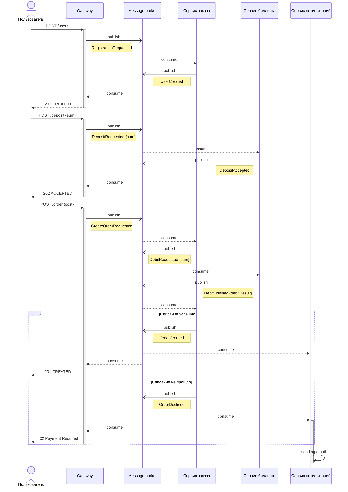

```mermaid
sequenceDiagram

actor User as Пользователь
participant Gateway
participant Message broker
participant OrderService as Сервис заказа
participant BillingService as Сервис биллинга
participant NotificationService as Сервис нотификаций

User->>+Gateway: POST /users
    Gateway-)Message broker: publish
    Note right of Gateway: RegistrationRequested

    Message broker-->>OrderService: consume
    OrderService-)Message broker: publish
    Note left of OrderService: UserCreated

    Message broker-->>Gateway: consume
Gateway-->>-User: 201 CREATED

User->>+Gateway: POST /deposit {sum}
    Gateway-)Message broker: publish
    Note right of Gateway: DepositRequested {sum}

    Message broker-->>BillingService: consume
    BillingService-)Message broker: publish
    Note left of BillingService: DepositAccepted

    Message broker-->>Gateway: consume
Gateway-->>-User: 202 ACCEPTED

User->>+Gateway: POST /order {cost}
    Gateway-)Message broker: publish
    Note right of Gateway: CreateOrderRequested

    Message broker-->>OrderService: consume
    OrderService-)Message broker: publish
    Note left of OrderService: DebitRequested {sum}

    Message broker-->>BillingService: consume
    BillingService-)Message broker: publish
    Note left of BillingService: DebitFinished {debitResult}

    Message broker-->>OrderService: consume
alt Списание успешно
    OrderService-)Message broker: publish
    Note left of OrderService: OrderCreated

    Message broker-->>+NotificationService: consume
    Message broker-->>Gateway: consume

    Gateway-->>User: 201 CREATED
else Списание не прошло
    OrderService-)Message broker: publish
    Note left of OrderService: OrderDeclined

    Message broker-->>+NotificationService: consume
    Message broker-->>Gateway: consume

    Gateway-->>User: 402 Payment Required
end
deactivate Gateway

    NotificationService->>-NotificationService: sending email
```