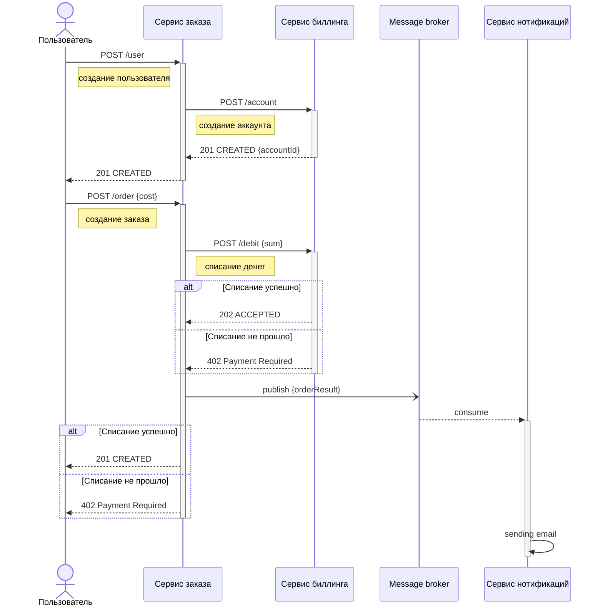

```mermaid
sequenceDiagram

actor User as Пользователь
participant OrderService as Сервис заказа
participant BillingService as Сервис биллинга
participant Message broker
participant NotificationService as Сервис нотификаций

User->>+OrderService: POST /user
    Note right of User: создание пользователя
    
    OrderService->>+BillingService: POST /account
        Note right of OrderService: создание аккаунта
    BillingService-->>-OrderService: 201 CREATED {accountId}
OrderService-->>-User: 201 CREATED

User->>+OrderService: POST /order {cost}
    Note right of User: создание заказа

    OrderService->>+BillingService: POST /debit {sum}
        Note right of OrderService: списание денег
    alt Списание успешно
        BillingService-->>OrderService: 202 ACCEPTED
    else Списание не прошло
        BillingService-->>OrderService: 402 Payment Required
    end
    deactivate BillingService

    OrderService-)Message broker: publish {orderResult}

    Message broker-->>+NotificationService: consume

alt Списание успешно
    OrderService-->>User: 201 CREATED
else Списание не прошло
    OrderService-->>User: 402 Payment Required
end
deactivate OrderService

    NotificationService->>-NotificationService: sending email
```